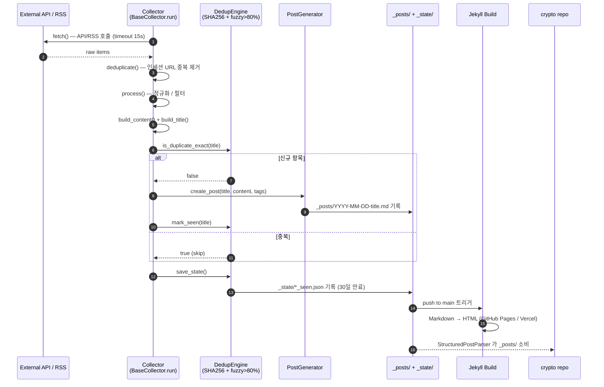
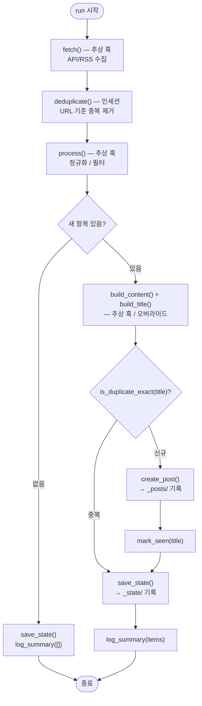

# Architecture

> 최종 현행화: 2026-07-13. 실측 카운트는 `ls scripts/collect_*.py`, `ls scripts/generate_*.py`,
> `find scripts/common -name '*.py'`, `ls .github/workflows/*.yml`, `ls pages/*.md`,
> `ls tests/test_*.py` 로 재검증 가능.

## 시스템 개요

Investing Dragon은 3-tier 아키텍처로 구성됩니다:

```
┌─────────────────────────────────────────────────────────────────────┐
│                        GitHub Actions (Cron)                        │
│  48 Workflows  │  per-collector concurrency groups  │  Auto Deploy  │
└────────┬────────────────────┬──────────────────────┬────────────────┘
         │                    │                      │
         ▼                    ▼                      ▼
┌─────────────────┐  ┌─────────────────┐  ┌──────────────────┐
│   Collection    │  │   Processing    │  │   Presentation   │
│                 │  │                 │  │                  │
│  13 Collectors  │─▶│  6 Generators   │─▶│  Jekyll Site     │
│  20+ Sources    │  │  Image Gen      │  │  GitHub Pages    │
│  Dedup Engine   │  │  Summarizer     │  │  15 Pages        │
└────────┬────────┘  └────────┬────────┘  └──────────────────┘
         │                    │
         ▼                    ▼
┌─────────────────────────────────────────┐
│           _state/*.json                 │
│   SHA256 Hash + Fuzzy Match (>80%)      │
│   30-day retention (max_age_days)       │
└─────────────────────────────────────────┘
```

전체 수집기(13개)는 `scripts/common/base_collector.py`의 `BaseCollector`(ABC)를
상속하여 동일한 실행 파이프라인을 공유합니다. 자세한 내용은
[BaseCollector 아키텍처](#basecollector-아키텍처) 참고.

## 데이터 흐름

수집 파이프라인은 `fetch → dedup(인세션) → process → build_content →
create_post → save_state` 순서로 진행되며, 생성된 포스트는 Jekyll 빌드를 거쳐
공개되고 crypto repo가 소비합니다.



## BaseCollector 아키텍처

모든 수집기는 `BaseCollector(ABC)`를 상속합니다. 서브클래스는 `name`, `category`,
`state_file` 클래스 변수를 설정하고 3개의 추상 메서드(`fetch`, `process`,
`build_content`)만 구현하면, 중복 방지·포스트 생성·상태 저장·메트릭 로깅은 기반
클래스가 처리합니다(템플릿 메서드 패턴).

| 구분 | 멤버 | 역할 |
|:-----|:-----|:-----|
| **추상 훅** | `fetch()` | 데이터 소스에서 항목 수집 |
| | `process(items)` | 정제·필터링 |
| | `build_content(items)` | 마크다운 본문 생성 |
| **오버라이드 가능** | `run()` | 메인 파이프라인 (다중 포스트 시 재정의) |
| | `build_title(items)` | 포스트 제목 |
| | `default_tags()` | 기본 태그 |
| **공통 유틸** | `deduplicate(items)` | 인세션 URL 중복 제거 |
| | `is_duplicate / is_duplicate_exact` | 크로스 세션 중복 검사 (DedupEngine) |
| | `mark_seen(title, source)` | 상태에 해시 기록 |
| | `create_post(...)` | PostGenerator 위임 (Jekyll 포스트 생성) |
| | `save_state()` | `_state/*.json` 기록 |
| | `log_summary(items)` | 수집 메트릭 로깅 |

`__init__`에서 `DedupEngine`, `PostGenerator`, KST 시각, `CollectorConfig`,
SSL 검증 설정을 자동 구성합니다. 클래스 변수가 비어 있으면 `ValueError`로 조기
실패합니다.



## 수집기 (Collectors) - 13개

전 수집기 `BaseCollector` 상속. 아래 스케줄은 `.github/workflows/collect-*.yml`의
실제 cron(UTC)이며 주석의 KST 환산을 함께 표기합니다.

| 수집기 | 카테고리 | 주요 소스 | Cron (UTC) | API 키 |
|:-------|:---------|:----------|:-----------|:-------|
| `collect_crypto_news` | crypto-news, security-alerts | CryptoPanic, Google News RSS(KR/EN), 거래소 공지(OKX/Binance/Bybit), Rekt News | `0 21,1,5,9,13,17 * * *` (4h) | `CRYPTOPANIC_API_KEY` (선택) |
| `collect_stock_news` | stock-news | Yahoo Finance RSS, yfinance(KR), KRX Google News, Alpha Vantage | `22 22,4,10,12,16 * * *` | `ALPHA_VANTAGE_API_KEY` (선택) |
| `collect_coinmarketcap` | crypto-news | CoinMarketCap API + CoinGecko(무료 fallback) | `37 */6 * * *` | `CMC_API_KEY`, `COINGECKO_API_KEY` (선택) |
| `collect_defi_llama` | crypto-news | DeFi Llama `/v2/protocols`, `/v2/chains` | `52 */6 * * *` | 불필요 |
| `collect_defi_yields` | crypto-news | DeFi Llama Yields API (`yields.llama.fi`) | `35 */6 * * *` | 불필요 |
| `collect_blockchain` | crypto-news | Blockchain.com API(BTC 해시레이트/난이도), Etherscan V2(ETH gas/supply) | `20 0 * * *` | `ETHERSCAN_API_KEY` (선택) |
| `collect_market_indicators` | market-analysis | Treasury yield / Put-Call / Margin debt (Google News RSS) | `0 14,22 * * 1-5` | 불필요 |
| `collect_fmp_calendar` | market-analysis | FMP API(경제 캘린더, 실적, 지수/섹터 시세) | `45 1,13 * * *` | `FMP_API_KEY` (선택) |
| `collect_social_media` | social-media | Telegram 공개 채널(HTML), Twitter/X API v2, Google News RSS(fallback) | `7 22,4,10,16 * * *` | `TWITTER_BEARER_TOKEN` (선택) |
| `collect_regulatory` | regulation | SEC/CFTC/Fed(US), FSC(KR), FSA/ESMA/FCA/MAS | `15 22,6,12 * * *` | 불필요 |
| `collect_political_trades` | political-trades | 미 의회 주식거래 공시, SEC EDGAR Form 4, 한국 정치인 자산공개 (Google News RSS) | `30 22,9 * * *` | 불필요 |
| `collect_geopolitical` | political-trades | Polymarket(예측시장), GDELT(글로벌 이벤트 톤), Google News RSS(EN/KR) | `52 21,9 * * *` | 불필요 |
| `collect_worldmonitor_news` | world-monitor | WorldMonitor RSS Proxy(지정학/안보/에너지) | `37 21 * * *` | 불필요 |

> NewsAPI는 2026-05-10 DEPRECATED(코드 사용처 0건, `NEWSAPI_API_KEY` 등록
> 불필요). 근거: `docs/data-sources.md`. 유효 소스가 아니므로 신규 연동 금지.

### 수집기 공통 동작 (`BaseCollector.run`)

1. **fetch**: 각 데이터 소스에서 항목 수집 (HTTP timeout 15s, certifi-first SSL)
2. **deduplicate**: 인세션 URL 중복 제거
3. **process**: 제목·본문 정규화 및 필터
4. **중복 검사**: `DedupEngine`으로 SHA256 해시 + fuzzy matching (>80%)
5. **create_post**: `PostGenerator`로 Jekyll 마크다운 생성 (`_posts/`)
6. **save_state**: `_state/*_seen.json`에 해시 기록 (30일 만료)
7. **log_summary**: `collector_metrics`로 수집 통계 출력

## 생성기 (Generators) - 6개

| 생성기 | 입력 | 출력 | 실행 |
|:-------|:-----|:-----|:-----|
| `generate_market_summary` | CoinGecko, Alpha Vantage, yfinance(KR), FRED, Fear&Greed | 시장 분석 포스트 + 시각화(히트맵/게이지/카드) | 서버 크론 / `workflow_dispatch` |
| `generate_daily_summary` | 당일 `_posts/` 전체 | 우선순위별 종합 요약 (P0 긴급 → P1 주요 → P2 주목) | `generate-daily-summary.yml` (`workflow_dispatch`) |
| `generate_weekly_digest` | 7일간 `_posts/` | 주간 하이라이트·카테고리 인사이트·실행 요약 | `weekly-digest.yml` (월 01:30 UTC) |
| `generate_weekly_report` | 주간 운영·수집 지표 | 주간 운영 리포트 | `generate-weekly-report.yml` (월 00:00 UTC) |
| `generate_ops_10am_digest` | 운영/수집 상태 | 오전 운영 다이제스트(Slack) | `ops-10am-digest.yml` (01:00 UTC) |
| `generate_og_images` | 포스트 front matter | OG/소셜 카드 이미지 | `generate-journal-og-images.yml` (push 트리거) |

> `generate-daily-summary.yml`, 시장 요약은 스케줄 대신 `workflow_dispatch`로
> 운영합니다(오전 9:10 KST 서버 크론 `server_morning_autopost.sh`이 1차 책임).

## 공통 모듈 (Common)

`scripts/common/`에는 최상위 모듈 + `image_generator/` 서브패키지 모듈이 있습니다
(실측 개수는 `docs/component-counts.md` — `__init__.py` 제외 기준). 핵심 모듈은 다음과 같습니다.

| 모듈 | 역할 |
|:-----|:-----|
| `base_collector.py` | 수집기 ABC (템플릿 메서드) — 13개 수집기 전부 상속 |
| `config.py` | 환경변수 로드, 로깅 (`get_env`, `setup_logging`, `get_verify_ssl`) |
| `collector_config.py` | `collectors.yml` 기반 수집기별 설정 로드 |
| `dedup.py` | 중복 방지 엔진 (SHA256 + `SequenceMatcher` fuzzy >80%) |
| `utils.py` | `sanitize_string`, `parse_date`, `request_with_retry` |
| `rss_fetcher.py` | RSS 피드 병렬 수집 |
| `post_generator.py` | Jekyll 포스트 생성 (front matter 계약 보장) |
| `enrichment.py` | 콘텐츠 추출, boilerplate 필터, 제목 중복 감지 |
| `summarizer*.py` | 요약(키워드/우선순위/차트) 계열 |
| `summary_*.py` | 일일 요약 파싱·분류·섹션·품질 계열 |
| `image_generator/` | 시장 시각화 서브패키지 (`base/coins/market/news/og`) |
| `og_*.py` | OG 이미지 렌더/합성/포맷 계열 |
| `crypto_api.py`, `fmp_api.py`, `blockchain_api.py` | 외부 API 클라이언트 |
| `translator.py`, `text_lang.py`, `text_utils.py` | 번역·언어 처리 |
| `collector_metrics.py`, `signal_tracker.py` | 메트릭/시그널 추적 |

> `scripts/common/` 변경은 13개 수집기 전부에 영향을 미치는 고-blast-radius
> 영역입니다. 시그니처 변경 시 전 수집기와 테스트 회귀 확인 필수.

## 중복 방지 시스템

```
입력: (title, source, date, url)
        │
        ▼
┌─────────────────────┐
│  1. 정규화           │  lowercase, strip whitespace/punctuation
└───────┬─────────────┘
        ▼
┌─────────────────────┐
│  2. SHA256 해싱      │  hash(normalize(title) + source + date[:10])
└───────┬─────────────┘
        ├── 해시 일치 → 중복 (건너뛰기)
        ▼ (해시 불일치)
┌─────────────────────┐
│  3. Fuzzy Matching  │  SequenceMatcher > 80%
└───────┬─────────────┘
        ├── 유사도 >80% → 중복 (건너뛰기)
        ▼ (유사도 <=80%)
┌─────────────────────┐
│  4. 새 항목 등록     │  해시 → _state/*.json (30일 만료)
└─────────────────────┘
```

`_state/*.json`은 중복 방지 상태이므로 수동 수정 금지(pre-commit-state-guard 훅이
커밋 차단).

## Jekyll 사이트 구조

### 페이지 (`pages/`) - 15개

| 페이지 | 설명 |
|:-------|:-----|
| `crypto-news.md` | 암호화폐 뉴스 |
| `stock-news.md` | 주식 뉴스 |
| `crypto-journal.md` | 크립토 트레이딩 일지 |
| `stock-journal.md` | 주식 트레이딩 일지 |
| `market-analysis.md` | 시장 분석 |
| `security-alerts.md` | 보안 알림 |
| `regulatory-news.md` | 규제 동향 |
| `political-trades.md` | 정치인 거래 |
| `social-media.md` | 소셜 미디어 |
| `worldmonitor.md` | 글로벌 모니터 |
| `blockchain.md` | 블록체인 지표 |
| `defi.md` | DeFi TVL/수익률 |
| `reports.md` | 리포트 |
| `search.md` | 검색 |
| `about.md` | 사이트 소개 |

### 테마
- minima 기반 **다크 파이낸스** 스타일, 반응형, Sass `@use` 모듈 구조

## CI/CD 파이프라인 - 48개 워크플로우

### 워크플로우 그룹

| 그룹 | 수 | 설명 |
|:-----|:--:|:-----|
| **수집** | 13 | `collect-*.yml` — 수집기별 독립 cron |
| **콘텐츠 생성** | 6 | daily-summary, weekly-digest, weekly-report, ops-10am-digest, journal-og-images, backfill-post-summaries |
| **품질/테스트** | 10 | code-quality, post-quality, check-post-images/summary, description-quality, coverage-comment, integrated-quality-report, lighthouse-ci, i18n-e2e, reports-e2e |
| **보안/공급망** | 5 | security-scan, dependency-check, supply-chain-lock(+reminder), dependabot-auto-merge |
| **배포/SEO** | 5 | deploy-pages, indexnow-submit, gsc-sitemap-submit, gsc-index-audit, notify-deploy-status |
| **모니터링/운영** | 9 | site-health-check, collector-heartbeat, watchdog-zero-job-runs, alert-consecutive-failures, classify-workflow-failures, push-folder-info-to-slack, respond-ai-mentions, continuous-improvement-loop, cleanup-old-images |

### 동시성 (Concurrency)

수집기는 각자 고유한 concurrency 그룹(`collect-crypto-news`, `collect-stock-news`
등)을 사용해 **수집기 간 병렬 실행**을 허용하되 **동일 수집기 내에서는 직렬화**
합니다. 배포/SEO 계열은 `pages`, `gsc-sitemap-submit` 등 별도 그룹, PR 트리거
워크플로우는 `${{ github.ref }}` 스코프 그룹으로 브랜치별 격리됩니다.

### 재사용 액션 (`.github/actions/`)

| 액션 | 용도 |
|:-----|:-----|
| `python-collect` | Python 수집 공통 실행 (Python + pip 캐시 + Playwright + SSL + commit/push retry) |
| `resolve-slack-config` | Slack 토큰/채널 후보 중 유효값 자동 선택 (ops/dev/security/investing) |

### 스케줄 타임라인 (실제 cron, UTC)

`.github/workflows/`의 cron과 동기화. KST = UTC + 9h.

```
매 6시간(오프셋):
  :35  collect-defi-yields
  :37  collect-coinmarketcap
  :52  collect-defi-llama

매 4시간:
  21,1,5,9,13,17시  collect-crypto-news

하루 2~3회:
  22,4,10,16 :07     collect-social-media
  22,4,10,12,16 :22  collect-stock-news
  22,6,12 :15        collect-regulatory
  22,9 :30           collect-political-trades
  21,9 :52           collect-geopolitical
  1,13 :45           collect-fmp-calendar
  14,22 :00 (평일)   collect-market-indicators

매일:
  00:10  collector-heartbeat
  00:20  collect-blockchain (09:20 KST — 서버 크론 09:10 KST 회피 오프셋)
  01:00  ops-10am-digest
  01:15  backfill-post-summaries
  01:30  push-folder-info-to-slack
  16:00  site-health-check
  18:30  check-post-images
  21:37  collect-worldmonitor-news

매주:
  월 00:00  generate-weekly-report
  월 01:30  weekly-digest
  월 02:00  dependency-check
  월 03:00  security-scan, gsc-index-audit
  월 04:00  supply-chain-lock, code-quality
  월 05:00  supply-chain-lock-promotion-reminder

이벤트/고빈도:
  Push to main                → deploy-pages, generate-journal-og-images(경로 필터)
  Workflow 실패               → classify-workflow-failures
  매시간(0 * * * *)           → respond-ai-mentions, continuous-improvement-loop
  5분마다(*/5)                → watchdog-zero-job-runs
```

> `cleanup-old-images.yml`은 cron이 등록돼 있으나 현재 비활성화 상태(워크플로우
> 주석 참조). 생성 이미지 정리는 레이아웃 존재 가드와 함께 운영됩니다.
