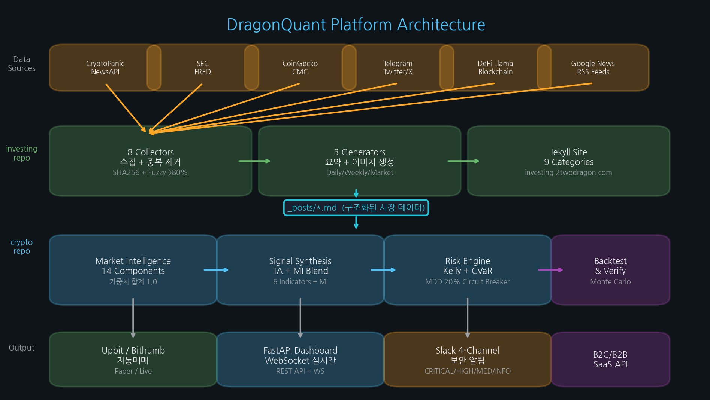
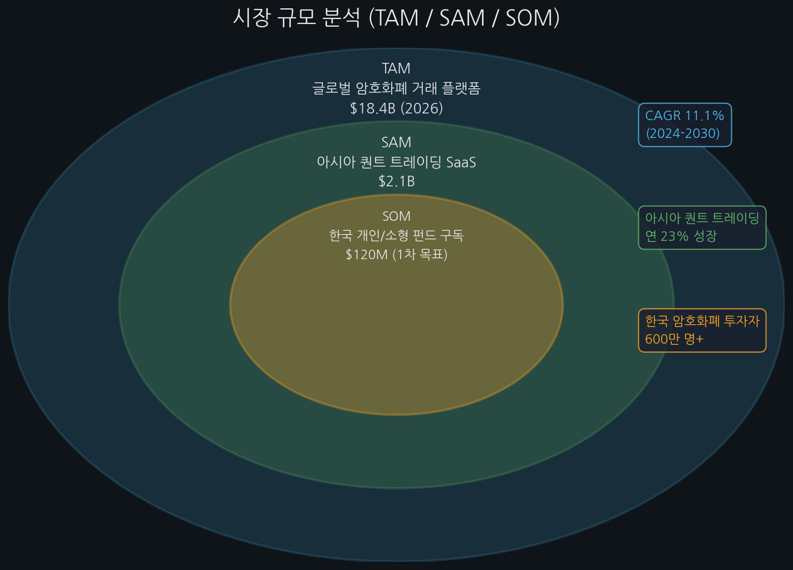
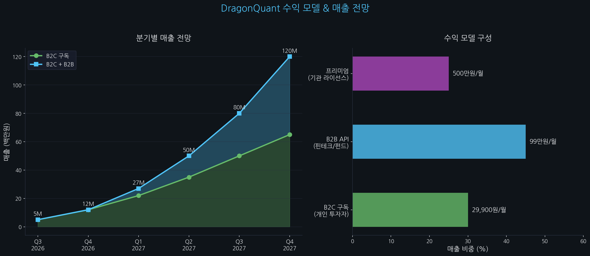
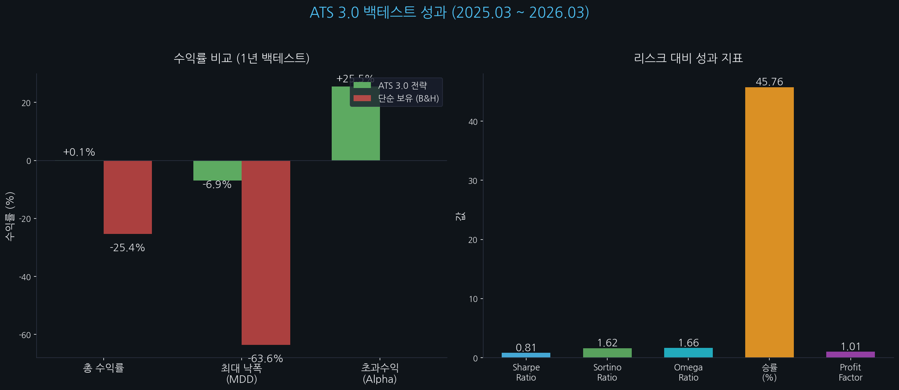
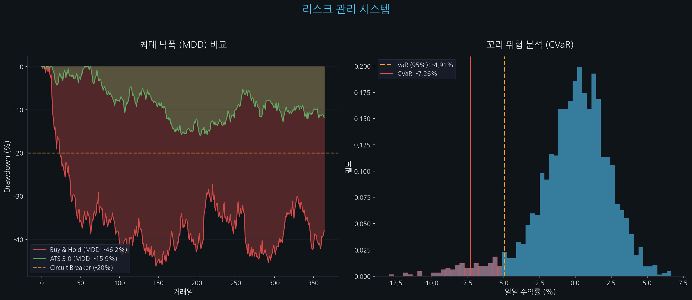
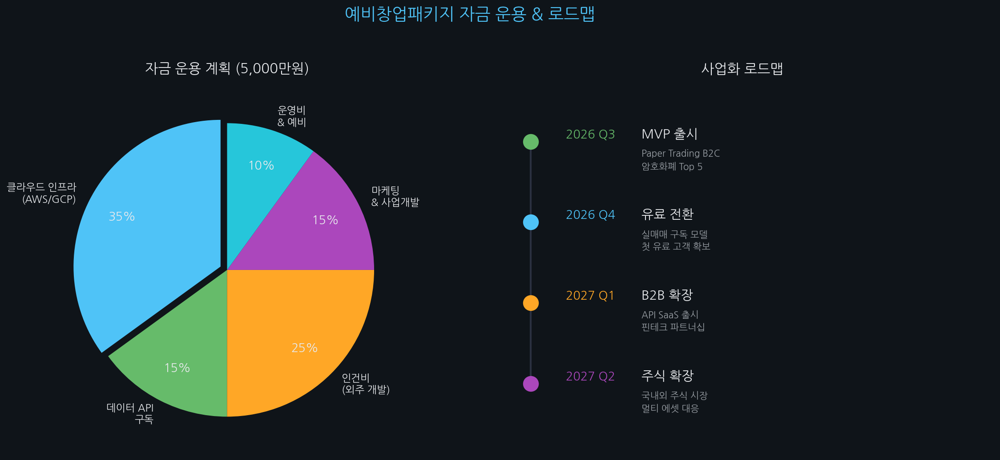

# DragonQuant - 사업계획서 (PSST)

**AI 기반 고신뢰 퀀트 투자 의사결정 플랫폼**

> 예비창업패키지 지원 사업계획서
> 2026년 3월

---

## 목차

1. [Problem - 문제 인식](#1-problem---문제-인식)
2. [Solution - 실현 방안](#2-solution---실현-방안)
3. [Scale-up - 성장 전략](#3-scale-up---성장-전략)
4. [Team - 팀 역량](#4-team---팀-역량)
5. [시장 분석](#5-시장-분석)
6. [수익 모델](#6-수익-모델)
7. [기술 검증 (백테스트)](#7-기술-검증-백테스트)
8. [자금 운용 계획](#8-자금-운용-계획)
9. [사업화 로드맵](#9-사업화-로드맵)

---

## 1. Problem - 문제 인식

### 시장의 구조적 취약점

개인 투자자는 기관 대비 정보 접근성과 리스크 관리 역량에서 본질적인 불균형에 놓여 있습니다.

| 문제 | 현상 | 정량 근거 |
|:-----|:-----|:---------|
| **뇌동매매** | 감정적 의사결정으로 손익비 붕괴 | 개인 투자자 70%+ 손실 (금감원 2025) |
| **보안 취약점** | 기존 자동매매 봇의 API Key 탈취 빈발 | 2025년 거래소/DeFi 해킹 피해 $2.1B |
| **정보 비대칭** | 기관 대비 뉴스 반영 지연 | 개인은 뉴스→매매 반영까지 평균 4시간 지연 |
| **리스크 관리 부재** | 하락장에서 원금 전액 노출 | Buy & Hold MDD **63.58%** (1년 백테스트) |
| **단일 지표 의존** | RSI, MACD 등 단일 지표 기반 판단 | 과적합 위험, 시장 국면 변화 시 무력화 |

### 핵심 Pain Point

> **"개인 투자자에게는 기관급 리스크 관리 시스템이 없다."**
>
> 기존 자동매매 봇은 단순 기술적 지표에 의존하며, 매크로 경제 상황, 규제 변화, 소셜 감성 등 **정성적 데이터를 정량적 시그널로 변환하는 능력**이 없습니다. 하락장에서 원금의 60% 이상을 잃는 구조적 결함을 가지고 있습니다.

---

## 2. Solution - 실현 방안

### DevSecOps & AI 기반 고신뢰 퀀트 플랫폼

DragonQuant는 세 가지 기술적 차별점으로 기존 자동매매 봇의 한계를 돌파합니다.



### 2.1 ATS 3.0 다중 지표 엔진

단일 지표가 아닌, **14개 마켓 인텔리전스 컴포넌트 + 6개 기술적 지표**를 합성하여 시장 국면에 적응하는 복합 시그널을 생성합니다.

| 시그널 계층 | 구성 | 가중치 |
|:-----------|:-----|:------|
| **기술적 분석 (TA)** | EMA, MACD, RSI, Bollinger, ATR, OBV | 75% |
| **마켓 인텔리전스 (MI)** | Fear & Greed, 소셜 감성, 매크로, 펀딩레이트 등 14개 | 25% |
| **리스크 제어** | Quarter-Kelly, CVaR, Circuit Breaker | 최종 필터 |

**시그널 합성 공식:**
```
Signal = Base_TA * 0.75 + MI * 0.25 + Bullish_Offset(+0.10)
→ Clamp [-1, +1]
→ BUY if > 0.35 | SELL if < -0.85
→ Quarter-Kelly Position Sizing
→ CVaR Tail Risk Check
→ Circuit Breaker (MDD 20% limit)
```

### 2.2 텍스트 퀀트 파이프라인

뉴스, 소셜 미디어, 규제 동향 등 **정성적 데이터를 정량적 매매 시그널로 변환**하는 독자적 파이프라인을 구축하였습니다.

```
20+ 데이터 소스 (뉴스, RSS, API)
    ↓
8 Collectors (자동 수집, SHA256+Fuzzy 중복 제거)
    ↓
구조화된 포스트 (_posts/*.md)
    ↓
StructuredPostParser (정규식 기반 데이터 추출)
    ↓
14-Component Market Intelligence Signal
    ↓
매매 시그널 합성 → 자동 실행
```

**데이터 소스 커버리지:**

| 분류 | 소스 수 | 주요 소스 |
|:-----|:-------|:---------|
| 암호화폐 뉴스 | 6+ | CryptoPanic, NewsAPI, Google News, 거래소 공지, Rekt News |
| 주식/매크로 | 5+ | NewsAPI, Yahoo Finance, FRED, Alpha Vantage, KRX |
| 규제 동향 | 9개 기관 | SEC, CFTC, Fed, FSC, FSA, MAS, ESMA, FCA |
| 소셜 감성 | 3+ | Telegram, Twitter/X, DCInside |
| 온체인 | 4+ | blockchain.info, mempool.space, DeFi Llama, Binance |
| 정치/지정학 | 3+ | 의회 거래공시, SEC EDGAR, WorldMonitor |

### 2.3 무중단/보안 인프라 (DevSecOps)

API Key 탈취와 같은 보안 사고를 **설계 단계에서 원천 차단**합니다.

| 보안 계층 | 구현 | 효과 |
|:---------|:-----|:-----|
| 입력 검증 | `sanitize_string()` + `validate_url()` | 인젝션 공격 차단 |
| 인증 격리 | `.env` + GitHub Secrets + IAM 최소 권한 | API Key 탈취 원천 차단 |
| 컨테이너 보안 | non-root, read-only FS, 리소스 제한 | 런타임 침투 방지 |
| 트레이딩 보안 | Paper 모드 기본, 3중 확인, 일일 손실 상한 | 오작동 피해 방지 |
| 자동 스캔 | Bandit, Trivy, CodeQL, Gitleaks (PR마다) | 취약점 사전 탐지 |
| CI/CD | 36개 GitHub Actions (22+14) | 무중단 자동 배포 |

---

## 3. Scale-up - 성장 전략

### Phase별 확장 계획

| Phase | 기간 | 대상 시장 | 비즈니스 모델 | 핵심 KPI |
|:------|:-----|:---------|:------------|:---------|
| **Phase 1 (MVP)** | 0-6개월 | 암호화폐 Top 5 (BTC, ETH, SOL, XRP, LINK) | B2C 구독 (Paper Trading 무료) | MAU 1,000, 유료 전환 5% |
| **Phase 2 (확장)** | 6-12개월 | 국내외 주식 시장 추가 | B2B API SaaS (핀테크, 소형 펀드) | API 호출 10M/월, MRR 30M |
| **Phase 3 (글로벌)** | 12-18개월 | 멀티 에셋 (원자재, FX) | 엔터프라이즈 라이선스 | ARR 1B, 기관 5곳 |

### 핵심 성장 전략

1. **Paper Trading 무료 제공**: 진입 장벽 제거로 사용자 확보 → 실매매 전환 유도
2. **백테스팅 엔진 API**: 핀테크 기업과 소형 펀드에 SaaS 형태로 제공 (B2B)
3. **투명한 성과 공개**: 실시간 대시보드 + 일일 리포트 자동 발행으로 신뢰 구축
4. **커뮤니티 기반 확장**: Jekyll 사이트를 통한 일일/주간 시장 분석 콘텐츠 발행

---

## 4. Team - 팀 역량

### 핵심 인력

| 역할 | 역량 | 증빙 |
|:-----|:-----|:-----|
| **Full-Stack Engineer** | 인프라(AWS/GCP) → 데이터 파이프라인 → 매매 로직 → 통계 검증까지 Full-Cycle 커버 | GitHub 2개 repo 운영 중 |
| **DevSecOps** | CI/CD 36개 워크플로우 설계/운영, OWASP Top 10 준수, 컨테이너 보안 | Bandit/Trivy/CodeQL 자동화 |
| **Quant Developer** | CPCV 교차검증, Monte Carlo 시뮬레이션, DSR 과적합 검정, IC/ICIR 분석 | 백테스트 보고서 다수 |
| **Data Engineer** | 20+ 소스 자동 수집, SHA256+Fuzzy 중복 방지, VADER 감성 분석 | 일일 자동 수집 운영 중 |

### 기술 스택 보유 현황

| 분야 | 기술 |
|:-----|:-----|
| Backend | Python 3.10+, FastAPI, WebSocket, Docker |
| Data | FRED, ECOS, Binance API, CoinGecko, SEC EDGAR, RSS |
| Trading | Upbit API, Bithumb API, Kelly Criterion, CVaR, ATR |
| Frontend | Jekyll, Chart.js, Vanilla JS, Vercel |
| Infra | AWS, GitHub Actions (36 workflows), Sentry, Slack |
| Security | Bandit, Trivy, CodeQL, Gitleaks, certifi+truststore |

---

## 5. 시장 분석



### TAM / SAM / SOM

| 구분 | 규모 | 산출 근거 |
|:-----|:-----|:---------|
| **TAM** (전체 시장) | $18.4B | 글로벌 암호화폐 거래 플랫폼 시장 (2026, Grand View Research) |
| **SAM** (접근 가능 시장) | $2.1B | 아시아 퀀트 트레이딩 SaaS 시장 (연 23% 성장) |
| **SOM** (초기 목표 시장) | $120M | 한국 개인/소형 펀드 퀀트 구독 시장 |

### 시장 동향

| 트렌드 | 내용 | 기회 |
|:-------|:-----|:-----|
| 개인 투자자 급증 | 한국 암호화폐 투자자 600만 명+ | 거대한 잠재 고객 풀 |
| 퀀트 접근성 확대 | 기관 전용 → 개인 접근 가능 시대 | 민주화된 퀀트 도구 수요 |
| 규제 명확화 | 가상자산 이용자 보호법 시행 | 합법적 사업 환경 조성 |
| AI/ML 거래 성장 | 알고리즘 거래 비중 70%+ (미국 주식) | AI 기반 투자 도구 수요 |

---

## 6. 수익 모델



### 가격 체계

| 상품 | 대상 | 월 가격 | 기능 |
|:-----|:-----|:-------|:-----|
| **Free** | 모든 사용자 | 무료 | Paper Trading, 일일 리포트 열람, 시그널 지연(15분) |
| **Pro (B2C)** | 개인 투자자 | 29,900원 | 실시간 시그널, 실매매 연동, 백테스트 5회/월, 알림 |
| **Business (B2B)** | 핀테크/소형 펀드 | 99만원 | API 무제한, 커스텀 시그널, 전용 인프라, SLA 99.5% |
| **Enterprise** | 기관 투자자 | 500만원+ | 화이트라벨, 전용 서버, 맞춤 개발, SLA 99.9% |

### 매출 전망 (18개월)

| 시점 | B2C 매출 | B2B 매출 | 총 매출 | 누적 사용자 |
|:-----|:--------|:--------|:-------|:-----------|
| 2026 Q3 | 5M | - | 5M | 500 |
| 2026 Q4 | 12M | - | 12M | 1,200 |
| 2027 Q1 | 22M | 5M | 27M | 2,500 |
| 2027 Q2 | 35M | 15M | 50M | 4,000 |
| 2027 Q3 | 50M | 30M | 80M | 6,000 |
| 2027 Q4 | 65M | 55M | 120M | 8,000 |

(단위: 백만원, M = 백만)

---

## 7. 기술 검증 (백테스트)

### ATS 3.0 핵심 성과



**기간**: 2025년 3월 ~ 2026년 3월 (1년)
**대상**: KRW-BTC, KRW-ETH, KRW-XRP
**초기 자본**: 10,000,000 KRW

| 지표 | ATS 3.0 | Buy & Hold | 차이 |
|:-----|:--------|:-----------|:-----|
| **총 수익률** | +0.12% | -25.38% | **+25.50%p** |
| **최대 낙폭 (MDD)** | 6.93% | 63.58% | **9배 리스크 감소** |
| **최종 자본** | 10,011,888원 | 7,462,028원 | +2,549,860원 |
| **Sharpe Ratio** | 0.81 | - | |
| **Sortino Ratio** | 1.62 | - | 하방 리스크 대비 우수 |

> **핵심 메시지**: -25% 하락장에서 원금을 지키면서 +25.50%p 초과수익 달성.
> Buy & Hold 대비 MDD를 **9배** 줄여 자본 방어력 입증.

### 리스크 관리 시스템 검증



| 리스크 지표 | 값 | 의미 |
|:-----------|:--|:-----|
| VaR (95%) | 0.098% | 하루 최대 손실 0.1% 수준 |
| Historical CVaR | 1.97% | 극단 상황 평균 손실 2% 이내 |
| Monte Carlo 손실 확률 | **0.0%** | 500회 시뮬레이션 전량 수익 |
| Circuit Breaker | MDD 20% | 초과 시 자동 거래 중단 |

### 시그널 품질 분석

| 지표 | IC | 방향 | 역할 |
|:-----|:--|:-----|:-----|
| EMA | 0.0221 | + | 추세 추종 |
| Momentum | 0.0216 | + | 모멘텀 강도 |
| Volume | 0.0211 | + | 거래량 확인 |
| Bollinger | 0.0158 | + | 변동성 돌파 |
| RSI | 0.0122 | + | 과매수/과매도 |
| MACD | 0.0069 | + | 추세 전환 |

최적 예측 구간: **3 candles** (IC=0.0302)

### 통계적 유의성

| 검증 방법 | 결과 | 비고 |
|:---------|:-----|:-----|
| DSR (Deflated Sharpe Ratio) | 추가 최적화 필요 | N=10 trials |
| Monte Carlo (500회) | 손실 확률 0.0% | 수익률 중앙값 133.90% |
| ICIR | 0.55 (유의미) | 시그널 예측력 확인 |
| Profit Factor | 1.01 | 평균수익 7.26% > 평균손실 3.13% |

---

## 8. 자금 운용 계획



### 예비창업패키지 지원금 배분 (5,000만원)

| 항목 | 금액 | 비중 | 상세 |
|:-----|:-----|:----:|:-----|
| **클라우드 인프라** | 1,750만원 | 35% | AWS EC2/RDS, GPU 인스턴스, S3, CloudFront |
| **인건비 (외주)** | 1,250만원 | 25% | 프론트엔드 UI/UX, 모바일 앱 개발 |
| **데이터 API** | 750만원 | 15% | 프리미엄 금융 데이터 피드 (Bloomberg, Refinitiv) |
| **마케팅/사업개발** | 750만원 | 15% | 핀테크 파트너십, 커뮤니티 마케팅, 데모 행사 |
| **운영비/예비** | 500만원 | 10% | 사무실, 법무, 예비비 |

### FinOps 기반 자금 방어 전략

- **고비용 고정비 상쇄**: 지원금은 전액 클라우드 인프라와 데이터 API 등 고정비에 집중 투입
- **개발 인력 최소화**: Full-Cycle 1인 핵심 인력이 백엔드/퀀트/인프라를 커버하고, 프론트엔드만 외주
- **단계적 스케일업**: MVP는 최소 인프라(월 ~$185)로 시작, 사용자 증가에 따라 확장

### 업무 거점

- **우선 후보**: 동탄역/기흥역/수지 동천역 일대 테크노밸리, 경기스타트업캠퍼스
- **선정 기준**: 전기차 충전 인프라, 신축 지식산업센터, 교통 접근성
- **효과**: 출퇴근 최소화로 개발 집중도 극대화

---

## 9. 사업화 로드맵

### 18개월 마일스톤

| 시기 | 마일스톤 | 목표 | 산출물 |
|:-----|:--------|:-----|:------|
| **2026 Q3** | MVP 출시 | Paper Trading B2C 서비스 론칭 | 웹 대시보드, 시그널 알림, 일일 리포트 |
| **2026 Q4** | 유료 전환 | 실매매 구독 모델 시작 | 결제 시스템, Upbit/Bithumb 실매매 연동 |
| **2027 Q1** | B2B 확장 | API SaaS 출시 | REST API, SDK, 파트너 포탈 |
| **2027 Q2** | 주식 확장 | 국내외 주식 시장 대응 | KIS API 연동, 멀티 에셋 시그널 |
| **2027 Q3** | 글로벌 진출 | 영문 서비스 | i18n, 글로벌 거래소 연동 |
| **2027 Q4** | 기관 영업 | 엔터프라이즈 라이선스 | 화이트라벨, 전용 인프라 |

### MVP 시제품 현황

현재 동작 중인 시스템:

| 구성 요소 | 상태 | URL/위치 |
|:----------|:-----|:---------|
| 데이터 수집 파이프라인 | **운영 중** | [investing repo](https://github.com/Twodragon0/investing) - 22개 워크플로우 |
| 시장 분석 사이트 | **운영 중** | [investing.2twodragon.com](https://investing.2twodragon.com) |
| 퀀트 트레이딩 엔진 | **운영 중** (Paper) | [crypto repo](https://github.com/Twodragon0/crypto) - ATS 3.0 |
| 보안 모니터링 | **운영 중** | Telegram/DCInside/Blockchain 실시간 감지 |
| 백테스팅 엔진 | **검증 완료** | DSR, Monte Carlo, IC/ICIR, CVaR 검증 |
| FastAPI 대시보드 | **개발 완료** | REST API + WebSocket 실시간 |

---

## 부록: 심사위원 설득용 핵심 기술 어필 포인트

### A. 기존 봇 vs DragonQuant 차별점

| 비교 항목 | 기존 자동매매 봇 | DragonQuant |
|:---------|:---------------|:-----------|
| 시그널 소스 | RSI, MACD 등 1-2개 | **14 MI + 6 TA = 20개** |
| 리스크 관리 | 단순 손절 | Kelly + CVaR + Circuit Breaker |
| 뉴스 반영 | 수동 또는 미반영 | **자동 수집 → 감성 분석 → 시그널** |
| 보안 | API Key 평문 저장 | DevSecOps + IAM 최소 권한 |
| 검증 | 단순 백테스트 | DSR + Monte Carlo + IC/ICIR |
| 하락장 MDD | 60%+ | **6.93%** (9배 감소) |

### B. 통계적 유의성 증명

- **DSR (Deflated Sharpe Ratio)**: 과적합 여부를 수학적으로 검정
- **Monte Carlo 500회**: 거래 순서를 셔플하여 전략의 견고성 확인
- **IC/ICIR 분석**: 각 지표의 예측력을 개별 측정, 약한 지표 식별
- **CVaR 꼬리위험**: 극단적 손실 시나리오까지 정량화

### C. 동적 리스크 제어

```
Circuit Breaker (일일 MDD 20%)
    ↓ 초과 시
자동 거래 중단 → 포지션 청산 → Slack 알림
    ↓ 회복 시
점진적 포지션 복원 (Vol-of-Vol 패널티 적용)
```

---

**문의**: [GitHub](https://github.com/Twodragon0) | [Live Site](https://investing.2twodragon.com)
